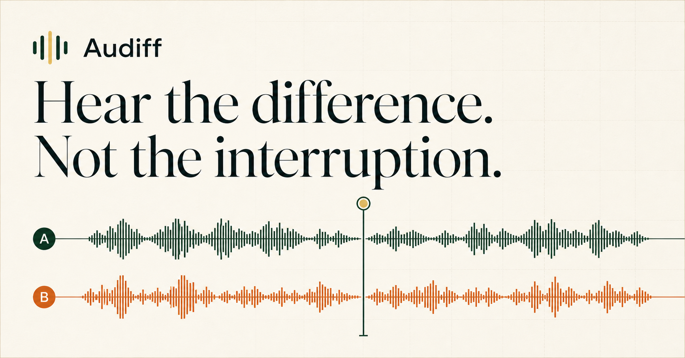

# Audiff

Audiff is a private, browser-based A/B audio comparison tool. Load two versions of the same recording, press play once, and switch between A and B without losing your place.



## What it does

- Keeps both files playing on one synchronized timeline.
- Switches the audible source with an 18 ms crossfade to avoid clicks without masking meaningful differences.
- Continuously corrects playback drift greater than 40 ms.
- Uses the longer file for the shared timeline when durations differ.
- Shows exactly where a shorter file ends and lets the longer file continue.
- Generates lightweight waveform previews in the browser.
- Supports drag-and-drop, file replacement, seeking, looping, volume control, and keyboard shortcuts.
- Processes audio locally. Files are never uploaded or stored by the app.

## Requirements

- Node.js 22.13 or newer
- npm 10 or newer (included with current Node.js releases)
- A modern browser with Web Audio support

## Install and run

```bash
git clone <your-repository-url>
cd audio-comparison
npm install
npm run dev
```

Open [http://localhost:3000](http://localhost:3000).

For a production build:

```bash
npm run build
npm run start
```

## Use

1. Drop the first audio file on **A** and the second on **B**. You can also drop two files onto either zone at once.
2. Press the central play button or the space bar.
3. Press **1** / **A** for Audio A or **2** / **B** for Audio B. Playback stays at the same timestamp.
4. Drag anywhere on the waveform timeline to seek. Use the arrow keys to jump five seconds.

### Keyboard shortcuts

| Key | Action |
| --- | --- |
| `Space` | Play or pause |
| `1` or `A` | Listen to Audio A |
| `2` or `B` | Listen to Audio B |
| `←` / `→` | Seek backward / forward five seconds |
| `L` | Toggle timeline loop |

## Supported files

Compatibility depends on the browser. Common formats such as WAV, MP3, M4A/AAC, FLAC, OGG, Opus, WebM audio, and AIFF are accepted when the browser can decode them.

Waveform generation is skipped for files larger than 300 MB to avoid excessive memory use; playback still works. Extremely long or lossless files may take a moment to analyze.

## Duration mismatch behavior

The shared player always uses the longer duration. If the selected source has already ended at the current timestamp, Audiff intentionally plays silence and labels that state; switch to the longer source to continue hearing audio. Seeking back into the overlapping range reactivates both files and restores synchronized comparison.

## Project structure

```text
app/
  layout.tsx       Metadata and social sharing configuration
  page.tsx         Audio engine and complete user interface
  globals.css      Responsive visual system
public/
  og.png           Social preview image
tests/
  rendered-html.test.mjs
```

The app uses React, vinext/Next-compatible APIs, the Web Audio API, and Lucide icons. It has no backend, account system, database, or upload service.

## Quality checks

```bash
npm run build
npm run lint
npm test
```

## Privacy

Object URLs and decoded buffers stay in the current browser tab. Audiff revokes object URLs when files are removed or the page closes. No analytics, cookies, network upload, or persistent storage is used.

## License

Add the license that fits your repository before distributing the project publicly.
