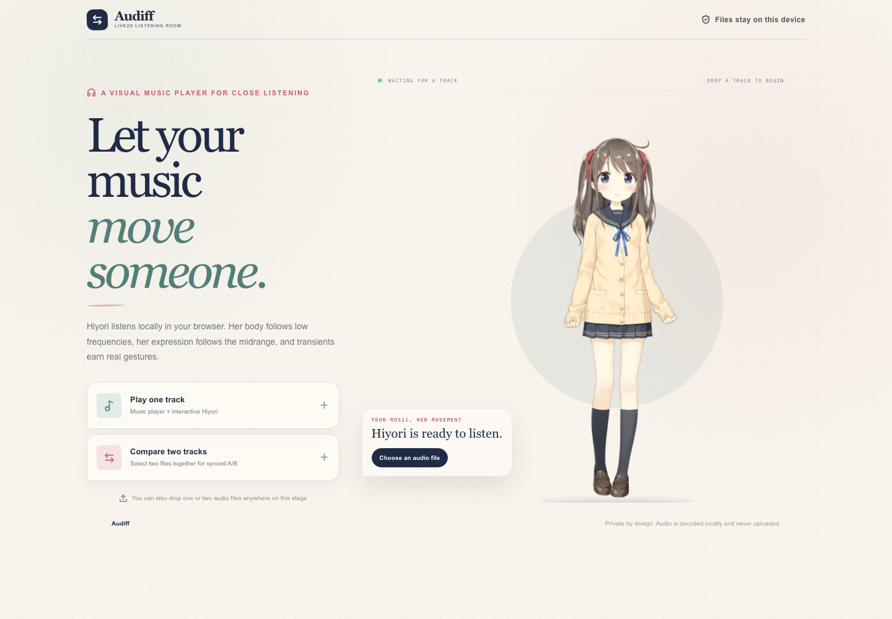
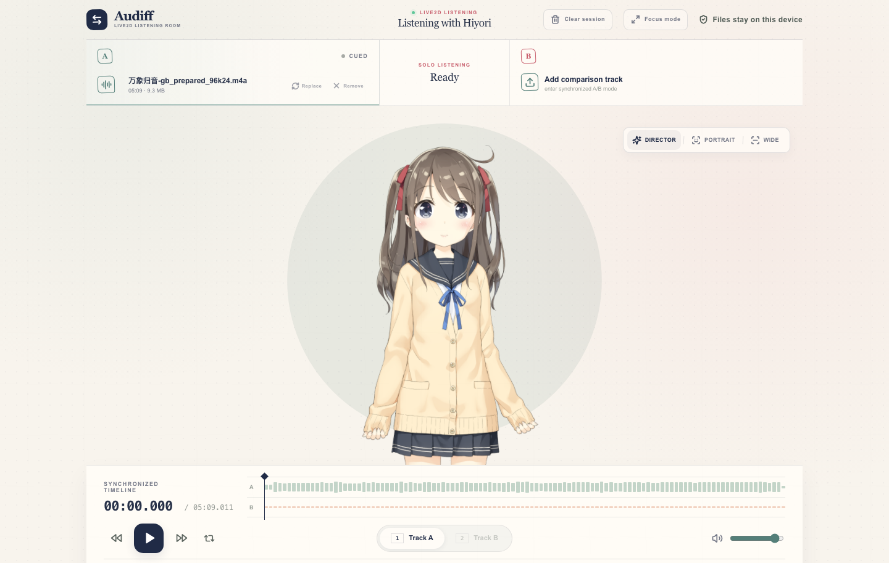
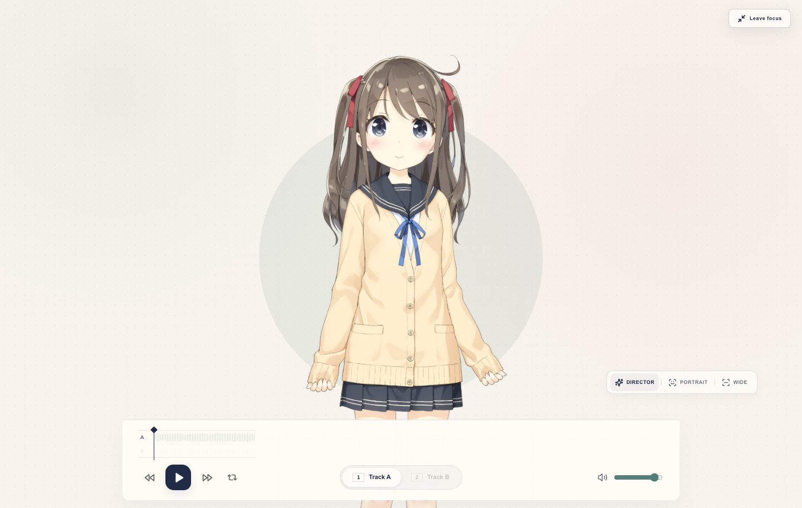

# Audiff

Audiff is a private, browser-based visual music player and sample-accurate A/B comparison tool. Load one local track to listen with an interactive Live2D companion, or load two versions and switch between them without losing the shared playback position.

[Open the live app](https://wedoso.github.io/Audiff/) · [Architecture](docs/architecture.md)



## Listening modes

### One-track listening



- Audio is decoded and analyzed locally in the current browser tab.
- Live2D's official Hiyori `hiyori_m01` motion leads the listening performance.
- Learned body beats add restrained nod accents without replacing the authored pose.
- A solid A/B-colored disc accumulates three low-frequency size tiers, then releases slowly instead of flashing on every transient.
- Director mode frames phrase-scale energy automatically; the mouse wheel switches to manual framing.

### Focus mode



Press `F` to move into a close listening view. Hiyori and the solid music disc begin moving at the same moment the score strip and header context withdraw; exit reverses the same shared timeline. The persistent Pixi canvas is never recreated or continuously resized during the shot. The existing waveform and A/B selector remain available—Focus mode does not create a second control system.

### Two-track comparison

- Both decoded files start from one `AudioContext` clock.
- Switching A/B changes gain only; it never seeks, restarts, or changes playback speed.
- An 18 ms gain crossfade prevents clicks without hiding meaningful differences.
- The longer track defines the shared timeline; the shorter track's endpoint is marked explicitly.
- Hiyori's gaze follows the currently audible track while comparison playback is active.

## Live2D behavior

Audiff uses Hiyori's official motion as the primary performance instead of rebuilding character movement from raw coordinates.

- **Playing:** the official `Idle[0]` loop supplies coordinated face, head, torso, arm, hair, and ribbon movement. A queue watchdog restarts that same motion only if the SDK genuinely has no active listening motion.
- **Paused:** the authored motion stops and its complete pose eases to neutral over 680 ms. SDK blink, Natural Breath, pointer focus, Physics, and subtle secondary motion remain alive.
- **Loop continuity:** six non-matching endpoints in the official 4.7-second clip are corrected over the final 720 ms using Cubism's actual motion clock.
- **Beat response:** broadband and bass onsets learn a per-track 0.5–1.0 second body groove. Scheduled beats produce one eased 360 ms nod accent rather than hi-hat-speed twitching.

See [docs/architecture.md](docs/architecture.md) for parameter ownership, signal processing, camera rules, transitions, and deployment invariants.

## Privacy

Audio files, decoded buffers, waveform peaks, and analysis data stay inside the current tab. Audiff has no backend, account system, database, cookies, analytics, upload endpoint, or persistent audio storage.

## Use

1. Choose or drop one audio file.
2. Press the central play button or `Space`.
3. Optionally add Audio B for synchronized comparison.
4. Use `1` / `A` for Audio A and `2` / `B` for Audio B.
5. Drag the timeline to seek, or use the arrow keys to move five seconds.
6. Scroll over Hiyori for manual camera zoom; choose **Director** to resume automatic framing.
7. Press `F` for Focus mode and `Esc` to leave it.
8. Choose **Clear session** to return through the reverse scene transition.

### Keyboard shortcuts

| Key | Action |
| --- | --- |
| `Space` | Play or pause |
| `1` or `A` | Listen to Audio A |
| `2` or `B` | Listen to Audio B |
| `←` / `→` | Seek backward / forward five seconds |
| `L` | Toggle timeline loop |
| `F` | Enter or leave Focus mode |
| `Esc` | Leave Focus mode |

## Supported audio

Compatibility depends on the browser's Web Audio decoder. Audiff accepts common WAV, MP3, M4A/AAC, FLAC, OGG, Opus, WebM audio, and AIFF files. Files are fully decoded in memory so both tracks can share an exact clock; files larger than 300 MB are rejected to protect the tab.

## Local development

Requirements: Node.js 22.13 or newer and npm 10 or newer.

```bash
git clone https://github.com/wedoso/Audiff.git
cd Audiff
npm ci
npm run dev
```

Open [http://localhost:5173](http://localhost:5173).

Run the complete validation suite with:

```bash
npm run check
```

This runs ESLint, TypeScript, the Vite production build, and the static architecture regression suite.

## Deployment

`npm run build` emits a fully static `dist/` directory. Vite uses relative asset paths, so the same output works at a domain root or a GitHub Pages repository path.

The included [GitHub Pages workflow](.github/workflows/deploy-pages.yml) runs `npm ci`, `npm run check`, and deploys `dist/` on every push to `main` or `master`. Configure **Settings → Pages → Source** as **GitHub Actions** once for a new fork.

Other static hosts can use:

- Build command: `npm run build`
- Publish directory: `dist`
- Required server functions: none

## Project structure

```text
index.html                 Static document and social metadata
src/
  App.tsx                  Audio engine and complete interface
  Live2DStage.tsx          Hiyori motion, camera, shadow, and stage visuals
  audioVisual.ts           Web Audio features and transient signal
  index.css                Responsive visual and motion system
public/
  live2d/hiyori/           Official Hiyori model, motion, physics, and notice
  live2d/live2dcubismcore.min.js
  og.png                   Current social preview
docs/
  architecture.md          Runtime design and invariants
  assets/                  README screenshots
tests/
  static-build.test.mjs    Build and architecture regressions
.github/workflows/
  deploy-pages.yml         GitHub Pages CI/CD
```

## Live2D notice and license

Hiyori Momose is a sample model created by Live2D. The model notice is included at [`public/live2d/hiyori/LICENSE-HIYORI.txt`](public/live2d/hiyori/LICENSE-HIYORI.txt). Use and redistribution of the sample model and Cubism runtime remain subject to Live2D's Free Material License Agreement and Terms of Use; review them before publishing or commercial use.

Audiff's own source code is licensed under the [MIT License](LICENSE).
